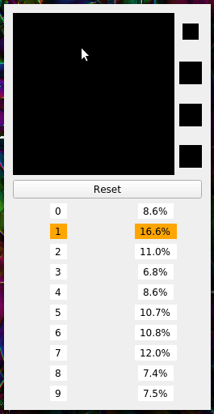
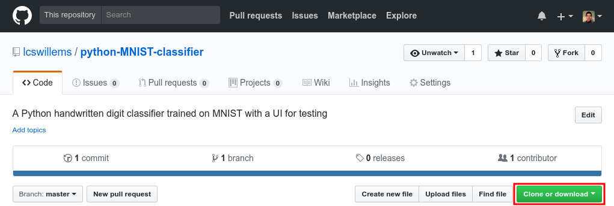
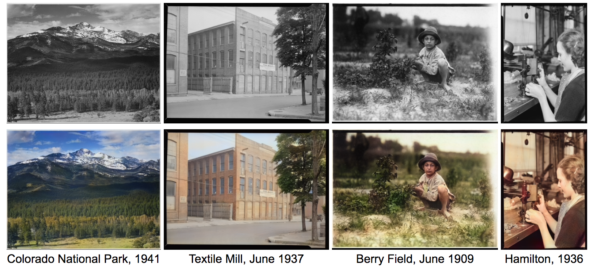

# Classifieur Python de chiffres manuscrits

<p align="center"></p>

Ce dépôt contient un classifieur de chiffres manuscrits écrit en Python. Il a été réalisé par [Lucas Willems](http://www.lucaswillems.com) pour sa présentation "[Le deep learning pour lire les codes postaux](http://seminairespourtous.ens.fr/ipt/1819/exposes/24/le-deep-learning-pour-remplacer-les-postiers)" au séminaire [Info Pour Tous 2018](http://seminairespourtous.ens.fr).

Si jamais vous rencontrez un quelconque problème, vous pouvez ouvrir une nouvelle issue sur [cette page](https://github.com/lcswillems/python-MNIST-classifier/issues) en cliquant sur "New issue".

Sommaire :

- [Installation](#installation)
    - [1. Python 3](#1-python-3)
    - [2. Bibliothèques Python](#2-bibliothèques-python)
    - [3. Code du classifieur](#3-code-du-classifieur)
- [Utilisation](#utilisation)
    - [Entraînement du modèle](#entraînement-du-modèle)
    - [Test du modèle](#test-du-modèle)
    - [Utilisation du modèle](#utilisation-du-modèle)
- [Structure du code](#structure-du-code)
    - [Création d'un modèle](#création-dun-modèle)
- [Pour aller plus loin](#pour-aller-plus-loin)

## Installation

Avant de pouvoir utiliser le classifieur, vous devez installer les programmes requis.

### 1. Python 3

La première étape de la procédure consiste à installer Python 3, le langage de programmation dans lequel est écrit le classifieur. Voici, pour chaque système d'exploitation, la manière la plus simple de faire :
- pour Windows et Mac, [télécharger Python 3](https://www.python.org/downloads/) puis l'installer. Si jamais vous avez besoin de plus de détails, vous pouvez regarder [cette vidéo Youtube](https://www.youtube.com/watch?v=wp15jyylSEQ).
- pour Linux, ouvrir un terminal puis exécuter `sudo apt update` puis `sudo apt install python3`.

### 2. Bibliothèques Python

La version de base de Python 3 que vous venez d'installer possède beaucoup de fonctionnalités mais ne peut évidemment pas posséder toutes les fonctionnalités imaginables. Or, pour réaliser le classifieur, j'ai utilisé des fonctionnalités supplémentaires qui ne se trouvent pas dans la version de base. Ces fonctionnalités supplémentaires sont regroupées en ce que l'on appelle des bibliothèques ("libraries" en anglais).

6 bibliothèques ont été utilisées pour réaliser le classifieur :

- `tensorflow`: une bibliothèque pour faire du machine learning. Elle permet d'entraîner, tester et utiliser le classifieur.
- `PyQt5`: une bibliothèque pour avoir une interface graphique. Elle permet de dessiner des chiffres dans le mode `use` (voir section "Utilisation du modèle" plus bas).
- `matplotlib`: une bibliothèque pour afficher des graphiques, des images... Elle permet d'afficher les erreurs du classifieur dans le mode `test` (voir section "Test du modèle" plus bas).
- `h5py`: une bibliothèque pour manipuler des données. Elle permet de charger et de sauvegarder le classifieur sur votre ordinateur.
- `numpy`: une bibliothèque pour manipuler des tableaux à n dimensions. Elle permet de manipuler facilement les images par exemple.
- `scipy`: une bibliothèque pour faire des calculs scientifiques (statistiques, traitement du signal...). Elle permet d'appliquer certaines transformations sur une image dans le mode `use` (voir section "Utilisation du modèle" plus bas).
- `scikit-image`: une bibliothèque pour transformer les images Elle permet d'appliquer certaines transformations sur une image dans le mode `use` (voir section "Utilisation du modèle" plus bas).

Actuellement, ces bibliothèques ne se trouvent pas sur votre ordinateur. La deuxième étape de la procédure consiste donc à les télécharger puis les installer. Heureusement, Python inclut déjà un outil, appelé `pip`, permettant de le faire très facilement.

Si vous êtes sous Windows, ouvrez l'invité de commande (tapez "Invité de commande" ou "cmd" dans le menu Démarrer et cliquez sur le programme). Si vous êtes sur Linux ou Mac OS, ouvrez le terminal. Ensuite, dans tous les cas, exécutez la commande suivante :

```
pip3 install tensorflow pyqt5 matplotlib h5py numpy scipy scikit-image
```

### 3. Code du classifieur

La dernière étape de la procédure consiste à télécharger le code du classifieur. Pour ce faire, cliquez sur le bouton "Clone or download" en haut de [la page du dépôt](https://github.com/lcswillems/python-MNIST-classifier), puis sur "Download ZIP". A la fin du téléchargement, dézippez le fichier.

<p align="center"></p>

Voilà, l'installation est terminée ! Vous pouvez dès à présent utiliser le code. La section suivante explique comment faire.

## Utilisation

Pour utiliser le code, ouvrez un invité de commande dans le dossier `code`. Pour ce faire, appuyez sur la touche `shift` et faîtes un clique droit sur le dossier `code`, puis cliquez sur "Ouvrir une fenêtre de commande ici". Si jamais vous avez besoin de plus de détails, vous pouvez lire ce [petit tutoriel](https://www.howtogeek.com/howto/windows-vista/stupid-geek-tricks-open-a-command-prompt-from-the-desktop-right-click-menu/).

Dans cet invité de commande, vous pouvez exécuter des commandes. Par exemple, pour exécuter un programme Python contenu dans le fichier `monfichier.py`, vous pouvez utiliser la commande suivante :

```python3 monfichier.py```

Le seul fichier que vous allez toujours exécuter est `main.py` ("main" veut dire "principal" en français). Les autres fichiers seront seulement utilisés par le fichier `main.py`. Vous pouvez essayer la commande suivante :

```python3 main.py```

Vous devez obtenir l'erreur suivante : `main.py: error: the following arguments are required: --mode, --model`. La raison est que le fichier `main.py` a besoin de recevoir des précisions de l'utilisateur sur ce qu'il doit faire. Ces précisions s'appellent des **arguments**. Certains arguments, dits **optionnels**, ont des valeurs par défaut. Dans ce cas, l'utilisateur peut ne pas spécifier leurs valeurs, la valeur par défaut de l'argument est utilisée par le programme. Certains autres arguments, dits **requis**, n'ont pas de valeur par défaut. Dans ce cas, l'utilisateur doit tout le temps spécifier leurs valeurs.

Dans notre cas, plusieurs arguments sont optionnels, mais 2 arguments sont requis :
- `mode` : le mode d'utilisation. Il doit valloir soit `train`, soit `test`, soit `use`. L'utilité de ces modes est expliqué dans les sous-parties suivantes.
- `model` : le nom du modèle du classifieur. 3 modèles sont disponibles de base : `deepnet1`, `deepnet2` et `convnet`. Pour ajouter vos propres modèles, lisez [cette sous-partie](#création-dun-modèle).

Voici un exemple de commande :

```python3 main.py --mode train --model deepnet1```

Pour obtenir la liste de tous les arguments (requis et optionnels) ainsi que leur description, vous pouvez exécuter :

```python3 main.py --help```

### Entraînement du modèle

Le premier mode d'utilisation est `train`. Il vous permet d'entraîner votre modèle. De base, 3 modèles sont disponibles : `deepnet1`, `deepnet2` et `convnet`.

Par exemple, si vous souhaitez entraîner le modèle `deepnet2`, vous pouvez exécuter :

```python3 main.py --mode train --model deepnet2```

S'affiche d'abord un descriptif de votre modèle : les différents layers ("couches" en français) et le nombre de paramètres du modèle. Puis s'affiche ensuite :
- l'epoch (le numéro de l'entraînement sur toutes les données d'entraînement),
- la loss (la perte ou coût des erreurs) et l'accuracy (le taux de bonnes prédictions) mises à jour en temps réel.

Lors de la première exécution de cette commande, le programme commence par initialiser le modèle avec des paramètres aléatoires. Le modèle est alors au niveau 0 de l'apprentissage. Puis, comme par défaut `epoch = 1`, le programme entraîne le modèle sur toutes les données d'entraînement une fois. La loss décroît et l'accuracy augmente normalement, le modèle est en train d'apprendre.

Juste avant de finir de s'exécuter, le programme sauvegarde les paramètres du modèle dans le dossier `storage`. Ainsi, la prochaine fois, il chargera ces paramètres au lieu de prendre des paramètres aléatoires. Si vous voulez repartir d'un modèle `X` avec des paramètres aléatoires, vous pouvez supprimer ou renommer le fichier `X.h5` du dossier `storage` de telle sorte qu'il n'y ait plus de fichier `X.h5` dans le dossier.

Pour qu'il continue à apprendre, vous pouvez réexécuter la commande plusieurs fois si vous le voulez ou bien changer la valeur de l'argument `epochs`. Par exemple, si vous rajoutez `--epochs 5` à la commande précédente, le modèle sera entraîné 5 fois sur les données d'entraînement.

A chaque exécution de la commande, la loss devrait normalement diminuer et l'accuracy augmenter. Cela signifie que le modèle fait de moins en moins d'erreurs sur les données d'**entraînement**. Au bout d'un certain temps, la loss et l'accuracy vont finir par stagner. Cela signifie que le modèle a atteint ses performances maximales sur les données d'entraînement. Avec les valeurs par défaut des arguments, le modèle `deepnet2` peut facilement atteindre une loss de 0.015 et une accuracy de 0.995 après 50 epochs.

Vous pouvez aussi modifier la valeur des autres arguments optionnels pour influencer la vitesse d'apprentissage du modèle. Les valeurs par défaut ne sont pas les "meilleures" valeurs et les "meilleures" valeurs dépendent du modèle que vous entraîner. Sur le modèle `deepnet2`, vous pouvez essayer de voir l'impact :
- du learning rate en rajoutant `--lr X` où X est un petit nombre (entre 0.1 et 0.00001 typiquement). Sa valeur par défaut est 0.0001. Plus le learning rate est grand, plus les paramètres varient à chacune de leurs modifications. Si vous prenez 0.001 pour `X`, vous pouvez remarquer que votre modèle apprend plus rapidement ! Si vous prenez 0.01 pour `X`, il apprend encore plus rapidement au début, mais l'apprentissage devient vite chaotique : la loss augmente, diminue, augmente (elle oscille) et n'arrive pas à descendre en dessous de 0.03. Enfin, si vous prenez 0.1 pour `X`, l'apprentissage est chaotique dès le début. La meilleure stratégie pour entraîner le modèle le plus rapidement consiste à l'entraîner pendant environ 5 epochs avec un learning rate 0.01, puis ensuite de mettre le learning rate à 0.001 voire 0.0001.
- de l'optimiseur en rajoutant `--optimizer X` où X peut être `sgd` ou `adam`. `sgd` est l'algorithme de la descente la plus profonde ou descente de gradient. Il modifie les paramètres du modèle de manière à faire diminuer la loss. `adam` est une version améliorée de `sgd`. `adam` est l'algorithme utilisé par défaut : il performe bien mieux que `sgd`. Vous pouvez essayer en rajoutant `--optimizer sgd`.
- du nombre de données d'entraînement en rajoutant `--examples X` où X est le nombre d'exemples d'entraînement pouvant aller de 0 à 60000 (c'est-à-dire tous les exemples d'entraînement).

Maintenant que vous avez bien entraîné le modèle `deepnet2`, vous pouvez tester son niveau d'apprentissage en suivant les instructions de [la sous-partie suivante](#test-du-modele) ou alors entraîner un autre modèle.

2 autres modèles sont disponibles de base :
- `deepnet1` contient 1 layer dense contrairement à `deepnet2` qui en contient 2. Il est moins performant que ce dernier. Vous pouvez arriver à une loss de 0.25 et une accuracy de 0.93 après 50 epochs.
- `convnet` est plus performant que `deepnet2`. Il utilise une certaine opération mathématique appelée **convolution** (vous pouvez lire [cet excellent tutoriel pour débutant](https://adeshpande3.github.io/A-Beginner%27s-Guide-To-Understanding-Convolutional-Neural-Networks/) pour comprendre et [ce site internet](http://scs.ryerson.ca/~aharley/vis/conv/) pour visualiser). Vous pouvez arriver à une loss de 0.03 et une accuracy de 0.99 en 10 epochs.

Notez que l'entraînement de `convnet` est beaucoup plus lent !! Commencer avec un grand learning rate (0.01) puis le diminuer progressivement pour arriver à 0.0001 pourra vous économiser beaucoup de temps.

### Test du modèle

Une fois que vous avez entraîné votre modèle, il est temps de le tester, de voir s'il est capable de **bien généraliser**. La loss et l'accuracy affichées pendant l'entraînement donnent une bonne idée de l'avancement de l'apprentissage du modèle. Elles sont calculées sur les données d'**entraînement**. Elles ne donnent donc aucunement un ordre d'idée de la capacité du modèle à bien généraliser. Pour évaluer cette capacité, il nous faut tester notre modèle, c'est-à-dire regarder son accuracy sur des données de test qu'il n'a encore jamais vues.

Pour ce faire, il vous faut utiliser le mode `test` en exécutant, par exemple, la commande suivante :

```python3 main.py --mode test --model deepnet2```

L'accuracy sur les données de test s'affiche ainsi que 16 erreurs commises par votre modèle. Vous pouvez tester les 2 autres modèles.

Normalement, vous devez obtenir les accuracy suivantes à quelques choses près :
- 92.6% pour `deepnet1`
- 97.8% pour `deepnet2`
- 98.8% pour `convnet`

Nous pouvons faire deux remarques importantes :
1. Sur les données d'entraînement, `deepnet2` a une accuracy similaire voire meilleure que `convnet` alors qu'elle a une accuracy nettement inférieure sur les données de test.
2. Les trois modèles ont des accuracies supérieures sur les données d'entraînement que sur les données de test. On dit qu'elles **sur-interprètent**. Ce phénomène se passe aussi lorsque les humains apprennent : ils sont meilleurs sur des problèmes qu'ils ont déjà vus.

### Utilisation du modèle

Enfin, maintenant que vous avez obtenu un modèle performant, vous pouvez l'utiliser pour classifier de nouveaux chiffres manuscrits, qui ne sont pas dans les données d'entraînement ou de test. Par exemple, vous pouvez l'utiliser pour classifier vos propres chiffres manuscrits.

Pour ce faire, il vous faut utiliser le mode `use` en exécutant, par exemple, la commande suivante :

```python3 main.py --mode use --model convnet```

Vous pouvez dessiner votre chiffre dans le gros cadre noir. A chaque fois que vous relâchez votre clic, le modèle classifie le chiffre dessiné.

Vous pouvez remarquer 4 petits carrés noirs à droite du gros carré noir dans lesquels le chiffre dessiné apparaît légèrement modifié. Voici plus précisément quelles sont les transformations :
1. Dans le 1er petit carré, la partie noire tout autour du chiffre dessiné a été supprimée puis le chiffre a été redimensionné en conservant les proportions pour qu'il fasse moins 20 pixels de large et 20 pixels de hauteur.
2. Dans le 2e petit carré, des pixels noirs ont été ajoutés en bas et à droite pour que le chiffre fasse exactement 20 pixels de large et 20 pixels de hauteur.
3. Dans le 3e petit carré, le chiffre a été recentré en fonction de son [barycentre](https://fr.wikipedia.org/wiki/Barycentre).

La question que l'on peut se poser est : pourquoi appliquer de telles transformations avant de donner l'image au modèle ? Tout simplement parce que le modèle n'a pas été entraîné et testé sur n'importe quels chiffres manuscrits. Les données d'entraînement et de test étaient normalisées : les chiffres faisaient maximum 20 pixels de large et de hauteur et étaient centrés selon leur barycentre. Pour que le modèle puisse être performant sur les chiffres dessinés par les utilisateurs, il faut aussi appliquer cette normalisation.

Enfin, puisque nous venons de parler des transformations appliquées au chiffre dessiné dans le mode `use`, il est temps de vous parler de la transformation magique qui est systématiquement appliquée à une image de chiffre, que ce soit lors de l'entraînement, lors du test ou lors de l'utilisation. Cette transformation est la toute première appliquée et est appelée la **normalisation**. Une image étant un tableau de nombres entre 0 et 255, la normalisation consiste à diviser tous les nombres par 255 pour se retrouver avec un tableau de nombres entre 0 et 1. Normaliser l'image accélère l'apprentissage, mais je ne peux vous expliquer correctement la raison ici malheureusement. Cette transformation va encore rester quelques temps magique pour vous.

## Structure du code

Le dossier `code` contient :
- `main.py` : fichier principal
- `arguments.py` : fichier où sont définis les arguments de `main.py`
- `models.py` : fichier où sont définis les modèles `deepnet1`, `deepnet2`, `convnet`
- `ui.py` : fichier où est définie l'interface graphique pour le mode `use`
- `utils` : un dossier contenant les fichiers :
    - `data.py` permettant de charger les données et de faire les 4 transformations requises dans le mode `use`
    - `model.py` permettant de charger et de sauvegarder les paramètres d'un modèle
    - `plot.py` permettant d'afficher des exemples d'erreurs dans le mode `test`
- `storage` : un dossier contenant des sauvegardes des paramètres des différents modèles

### Création d'un modèle

Si vous voulez créer votre propre modèle `X`, vous devez créer une fonction `X` dans le fichier `models.py`. Voici des idées de modèle que vous pourriez créer :
- Vous pouvez enlever / ajouter des layers au modèle `deepnet2` et diminuer / agrandir la taille des layers.
- Vous pouvez enlever / ajouter plus de layers de convolution au modèle `deepnet2`, enlever les max-pooling, changer la taille des kernels, etc...

Essayez de créer un maximum de modèles, de les entraîner et de voir leur accuracy pour trouver le modèle qui obtient la plus haute accuracy.

## Pour aller plus loin

Vous avez fait un bel effort et avez sûrement beaucoup progressé ! Avant de continuer, [voici une ressource](https://playground.tensorflow.org/) que vous pouvez tester pour vous familiariser plus avec les réseaux de neurones. Vous pouvez vous amuser à replacer la fonction ReLU par d'autres fonctions, à changer le learning rate, le nombre de layers, les données, etc...

Maintenant, continuez vos efforts, vous pouvez aller plus loin encore et réaliser des choses remarquables. Le deep learning est en plein essort et permet d'accomplir des tâches incroyables. J'ai récemment découvert le **transfert de style**. Voici un exemple (et plein d'autres [ici](https://github.com/jcjohnson/neural-style)) :

<p align="center"></p>

Le modèle transforme une photo du campus de Stanford et un tableau "[La nuit étoilée](https://fr.wikipedia.org/wiki/La_Nuit_%C3%A9toil%C3%A9e)" de Van Gogh en un tableau du campus de Stanford peint avec le style de Van Gogh !

Vous pouvez aussi coloriser des images. Voici un exemple (et plein d'autres [ici](https://github.com/satoshiiizuka/siggraph2016_colorization)) :

<p align="center"></p>

Certaines autres applications incroyables de ce domaine sont répertoriées dans [cet article](http://www.yaronhadad.com/deep-learning-most-amazing-applications/).

Toutefois, pour être capable de reproduire ces résultats voire créer vos propres résultats (peut-être aurez-vous une idée incroyable aussi), il vous faut continuer à étudier.

Je pense qu'il vous faut :
- maîtriser Python,
- maîtriser la théorie du deep learning,
- beaucoup pratiquer.

Pour maîtriser Python, vous pouvez suivre le cours "[Apprendre à programmer en Python](https://openclassrooms.com/courses/apprenez-a-programmer-en-python)" de OpenClassrooms (sous format texte, vidéo, livre) qui vous donnera une compréhension complète du langage. Pour rentrer plus rapidement dans le langage mais moins en profondeur, vous pouvez regarder ma série de vidéos pour "[Apprendre Python](https://www.youtube.com/watch?v=A5dl7XRnmM4&list=PL5TvtEevd4IbBjsZe94pdU8r98DVr71rm)".

Pour maîtriser la théorie, je vous recommande très fortement de suivre la spécialisation "[Deep Learning](https://www.coursera.org/specializations/deep-learning)" (vous pouvez la suivre même en étant au lycée !). Le problème est que lorsqu'on accède à la page, suivre les cours semblent payant... Après des recherches sur internet, j'ai trouvé les pages spécifiques aux 5 cours :
- Cours 1 : "[Neural Networks and Deep Learning](https://www.coursera.org/learn/neural-networks-deep-learning/home/welcome)"
- Cours 2 : "[Improving Deep Neural Networks](https://www.coursera.org/learn/deep-neural-network/home/welcome)"
- Cours 3 : "[Structuring Machine Learning Projects](https://www.coursera.org/learn/machine-learning-projects/home/welcome)"
- Cours 4 : "[Convolutional Neural Networks](https://www.coursera.org/learn/convolutional-neural-networks/home/welcome)"
- Cours 5 : "[Sequence Models](https://www.coursera.org/learn/nlp-sequence-models)"

En allant sur ces pages, on pourrait encore penser que suivre les cours est payant, mais lorsque vous cliquez sur "Enroll", un petit texte "Audit the course" s'affiche. Cliquez sur "Audit". Vous pouvez accéder gratuitement à la partie la plus importante du cours : les vidéos. Vous pouvez apprendre beaucoup avec cela.

Pour pratiquer, je vous recommende de faire [les TPs confectionnés par Hvass](https://github.com/Hvass-Labs/TensorFlow-Tutorials) qui sont d'une qualité rarissime ! Si vous n'avez pas beaucoup de temps, vous pouvez vous contenter de faire les TPs 1, 2, 3, 4, 5 et 17 qui vous donneront de très bonnes bases avec Tensorflow, et ensuite, de lire les autres TPs attentivement. A travers ces TPs, vous apprendrez entre autre :
- [le transfert de style](https://github.com/Hvass-Labs/TensorFlow-Tutorials/blob/master/15_Style_Transfer.ipynb)
- [la traduction de texte](https://github.com/Hvass-Labs/TensorFlow-Tutorials/blob/master/21_Machine_Translation.ipynb)
- [les rêves profonds](https://github.com/Hvass-Labs/TensorFlow-Tutorials/blob/master/14_DeepDream.ipynb)
- ...

Voilà ! Vous avez de quoi faire ! Ne croyez pas que vous ne pouvez pas le faire. Je vous jure, vous pouvez ! Avoir les bases du domaine ne va pas être sans difficulté, mais c'est loin d'être infaisable ! Beaucoup de personnes se convertissent rapidement au deep learning. Personnellement, je n'ai commencé à m'intéresser au domaine qu'en Master 1 (tout seul, en suivant le cours de machine learning de l'ENS) parce que je ne l'ai découvert qu'en M1... Si je l'avais découvert au lycée, à coup sûr, je me serais lancé dans cette aventure.

Bon courage ! Battez-vous, percévérez. Votre travail paiera et vous pourrez rapidement peut-être créer des choses incroyables ! Tenez-moi au courant si vous le pouvez :) .